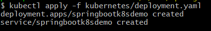
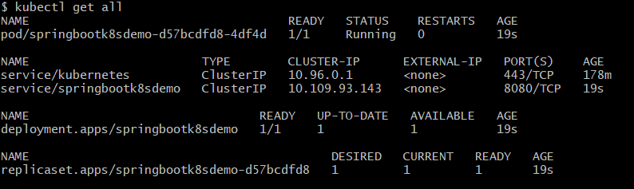
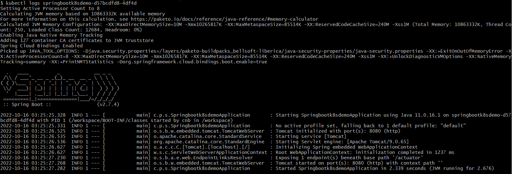

# Developer's Journal

## October 15, 2022 - Philip Posgate

Ok, it's been a long time since I last created a project on GitHub.  This will be another example of SpringBoot API, but this time with Docker and Kubernetes.  I am doing this with the recent experience I've gained as an engineer at SunLife, but using the standard practice that is described by the article at https://spring.io/guides/gs/spring-boot-kubernetes/.

My local workstation is Windows 11, with JDK11 and WSL and Docker Deskop installed.  I've configured my Docker Desktop to have Kubernetes enabled.  I can run both **docker** and **kubectl** command-line tools.  Executing the ```kubectl config current-context``` command reveals I am using my local **docker-desktop** cluster.  For command line, I switch between using Windows cmd and GitBash...but I generally prefer using GitBash for that "linuxy feel".  I'm also using Visual Studio Code as my IDE.

### Get the basic SpringBoot API working...

I generated a Gradle project called "springbootk8sdemo" at https://start.spring.io/ with just **web** and **actuator** dependencies.  I download the zip file and extract it on my local, do the usual ```git init``` and ```git remote add origin ...``` stuff, and push it up to https://github.com/philipposgate/springbootk8sdemo.  I also added this **JOURNAL.md** file to the project because I intend to journal my progress as I go.

Ok, first thing I do is make sure I can build and test the project.  So I make sure the ```./gradlew clean build``` and ```./gradlew clean test``` commands work, and they do.  After running the build command you can see the Java jar-file at ```build/libs/springbootk8sdemo-0.0.1-SNAPSHOT.jar```.  This is a self-executing jar that starts up a Tomcat instance.  So when I execute ```java -jar build/libs/springbootk8sdemo-0.0.1-SNAPSHOT.jar``` (or the ```./gradlew bootRun``` command) I can see SpringBoot start up in the standard output, and it opens port 8080.  With this I can hit http://localhost:8080/actuator in my browser and get a response from the API - **woohoo!**

### Get it running in Docker...

Now I want to get this baby running in a Docker container.  So according to the article I should execute ```./gradlew bootBuildImage```.  At first I wasn't sure what this would do.  I was hoping it would've generated a Dockerfile in the root of the project, but instead it just created an image in my local docker repo.  If I execute ```docker image ls``` I can see it as **springbootk8sdemo:0.0.1-SNAPSHOT**.

Now I need to test this image by running it.  So I execute ```docker run -p 8080:8080 springbootk8sdemo:0.0.1-SNAPSHOT``` and watch SpringBoot start up and I can hit http://localhost:8080/actuator like last time, except this time it's running in a Docker container - **woohoo!**

Note: What I really want is a Dockerfile in the root of my project, which i can "docker build" manually...I'll have to figure that out later.

Note: While my docker container is running I can see it with ```docker ps``` and I can stop it with ```docker stop <containerId>```.

### Get it running in Kubernetes...

The next thing I want to do is get the Docker image to run as a container in a Kubernetes cluster.  So I must define a "kubernetes manifest" for my application, which are yaml files.   According to the article we can execute a bunch of **kubectl** commands to generate the yaml manifest files, and then we can execute a **kubectl apply** command to upload the manifest to Kubernetes, which will trigger Kubernetes to automatically schedule a deployment of my app.

So here's how I generate my yaml manifest files...

```
mkdir kubernetes
kubectl create deployment springbootk8sdemo --image=springbootk8sdemo:0.0.1-SNAPSHOT --dry-run -o=yaml > kubernetes/deployment.yaml
echo --- >> kubernetes/deployment.yaml
kubectl create service clusterip springbootk8sdemo --tcp=8080:8080 --dry-run -o=yaml >> kubernetes/deployment.yaml
```

...now i have a **kubernetes/deployment.yaml** file in my project.  This is a super-basic kubernetes manifest for the application.  The manifest defines a "deployment" that describes which docker image to run, and a "service" that describes how the internal 8080 port should be exposed externally as 8080.

Now I execute ```kubectl apply -f kubernetes/deployment.yaml```.  This uploads my manifiest into my local kubernetes cluster, and show that my "deployment" and "service" got created.

e.g.



Now I want to inspect my deployment, so I execute ```kubectl get all```...  

e.g.



...which shows a bunch of stuff, including a pod called "springbootk8sdemo-d57bcdfd8-4df4d".  This pod represents a running instance of my application!

Now I want to see the logs from my pod, so I execute ```kubectl logs springbootk8sdemo-d57bcdfd8-4df4d```...

e.g.




Now I want to test my app.  If I try to hit http://localhost:8080/actuator in my browser at this time it won't work.  Even though the app is running in Kubernetes, and even though it has a "clusterIP service" for port 8080, I still can't reach it from my "host" computer.  There are several options to make this work, but for now I will use a simple "port-forward" technique by executing ```kubectl port-forward svc/springbootk8sdemo 8080:8080```.  This maps port 8080 on my "host" computer to port 8080 in the "cluster"....

...and THEN I can hit http://localhost:8080/actuator - **woohoo!**